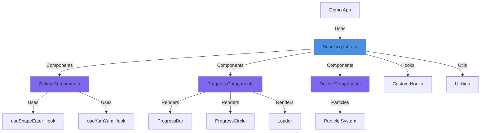
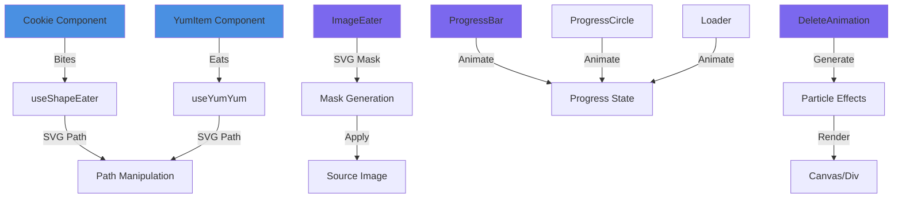
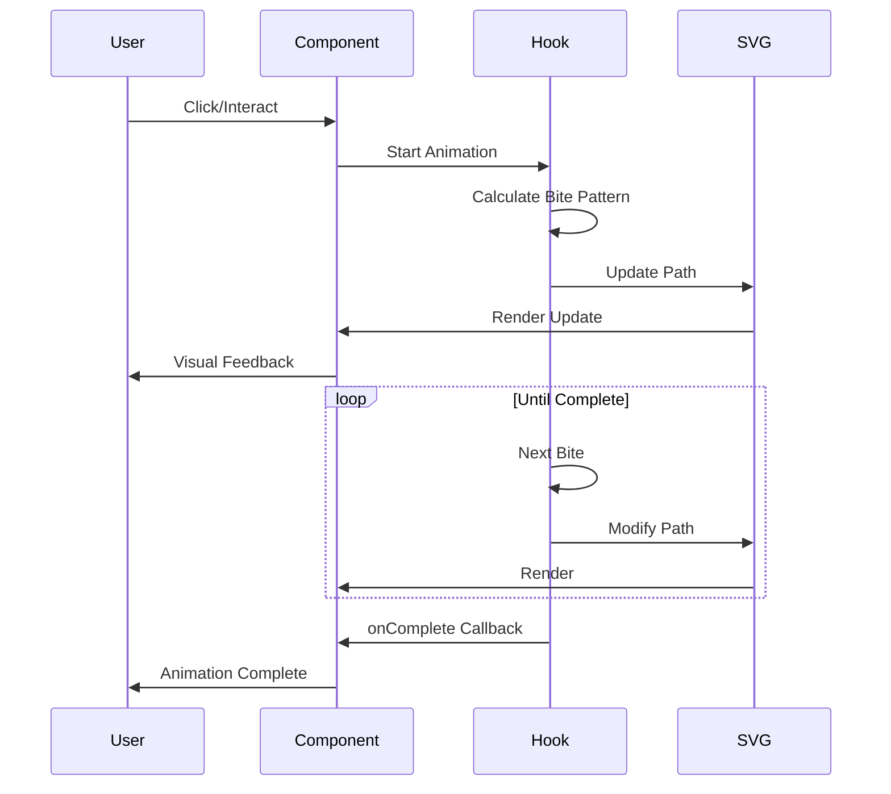

# Snacking Animation Library

A React library for creating interactive eating animations, loaders, progress indicators, and delete animations with customizable physics and visual effects.

## Overview

Snacking provides a comprehensive set of React components and hooks for creating engaging, interactive animations. The library focuses on "eating" animations where shapes are progressively consumed, but also includes progress indicators, image effects, and delete animations.

## Features

- 🍪 **Eating Animations** - Animate shapes being "eaten" with realistic bite patterns
- 📊 **Progress Indicators** - Animated progress bars and circles
- 🖼️ **Image Eating** - Apply eating effects to images using SVG masks
- 🗑️ **Delete Animations** - Smooth delete animations with particle effects
- ⚙️ **Highly Configurable** - Customize physics, visuals, and behavior
- 🎨 **Color Dominance** - Automatic color extraction and theming

## Architecture



## Component Architecture



## Technology Stack

- **React 19**: UI framework
- **TypeScript**: Type safety
- **SVG**: Path manipulation and masking
- **Canvas API**: Particle effects
- **Lucide React**: Icons
- **Vite**: Build tool and dev server

## Installation

```bash
npm install @snacking/animation-library
```

## Quick Start

```tsx
import { Cookie } from '@snacking/animation-library/components';

function App() {
  return (
    <Cookie
      onComplete={() => console.log('Cookie eaten!')}
      biteSpeed={100}
    />
  );
}
```

## Animation Flow



## Core Concepts

### Eating Animations

Shapes are "eaten" by progressively modifying their SVG path:

1. **Path Analysis**: Original path is analyzed for bite points
2. **Bite Generation**: Bites are created along the path perimeter
3. **Path Modification**: SVG path is updated to exclude bitten areas
4. **Visual Feedback**: Crumbs and particles provide visual feedback

### Progress Indicators

Progress components animate from 0 to target value:

- **ProgressBar**: Linear progress bar
- **ProgressCircle**: Circular progress indicator
- **Loader**: Animated loading spinner

### Image Eating

Images are "eaten" using SVG masks:

1. **Mask Generation**: SVG mask is created from shape
2. **Path Animation**: Mask path is animated to reveal/hide image
3. **Smooth Transitions**: Uses SVG path morphing for smooth effects

### Delete Animations

Delete animations use particle systems:

1. **Particle Generation**: Particles are generated from shape
2. **Physics Simulation**: Particles follow physics (gravity, velocity)
3. **Fade Out**: Particles fade and disappear
4. **Completion**: Callback fired when animation completes

## Project Structure

```
snacking/
├── src/
│   ├── components/
│   │   ├── animations/          # Animation components
│   │   │   ├── Cookie.tsx
│   │   │   ├── YumItem.tsx
│   │   │   ├── ImageEater.tsx
│   │   │   ├── ProgressBar.tsx
│   │   │   ├── ProgressCircle.tsx
│   │   │   ├── Loader.tsx
│   │   │   └── DeleteAnimation.tsx
│   │   └── Controls.tsx
│   ├── hooks/
│   │   ├── useShapeEater.ts     # Shape eating logic
│   │   └── useYumYum.ts         # Yum animation logic
│   ├── utils/
│   │   ├── image.ts             # Image utilities
│   │   └── audio.ts             # Audio utilities
│   ├── types.ts                 # TypeScript definitions
│   └── lib/
│       └── index.ts             # Library exports
├── docs/
│   ├── getting-started.md
│   ├── architecture.md
│   ├── api-reference.md
│   ├── examples.md
│   └── development.md
└── package.json
```

## Documentation

- **[Getting Started](./getting-started.md)**: Installation and quick start guide
- **[Architecture](./architecture.md)**: High-level overview and key concepts
- **[API Reference](./api-reference.md)**: Detailed component and hook documentation
- **[Examples](./examples.md)**: Code examples and usage patterns
- **[Development](./development.md)**: Contributing and local development

## Key Components

### Cookie
Interactive cookie that can be "eaten" with bite animations.

### YumItem
Generic shape-eating component with customizable food items.

### ImageEater
Applies eating effects to images using SVG masking.

### ProgressBar / ProgressCircle
Animated progress indicators with customizable styling.

### Loader
Animated loading spinner with configurable appearance.

### DeleteAnimation
Smooth delete animations with particle effects.

## Customization

All components support extensive customization:

- **Colors**: Custom color schemes and theming
- **Timing**: Adjustable animation speeds and durations
- **Physics**: Configurable particle physics
- **Visuals**: Customizable shapes, sizes, and effects
- **Callbacks**: Event handlers for animation events

## Browser Support

- Chrome/Edge (latest)
- Firefox (latest)
- Safari (latest)

Requires modern browser with SVG and Canvas support.

## License

MIT
