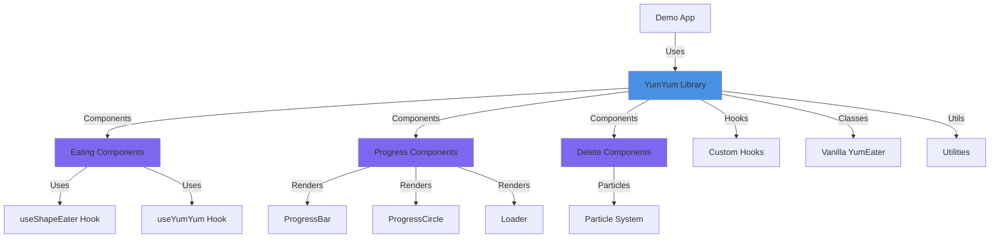
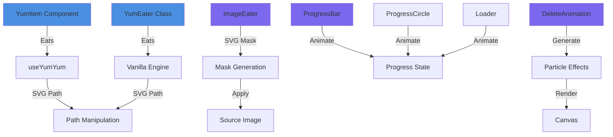

# YumYum Animation Library

A style-agnostic, low-dependency library for creating interactive eating animations, loaders, progress indicators, and delete animations with customizable physics and visual effects.

## Overview

YumYum provides a comprehensive set of framework-agnostic Vanilla JavaScript classes alongside React components and hooks for creating engaging, interactive animations. The library focuses on "eating" animations where shapes are progressively consumed, but also includes progress indicators, image effects, and delete animations.

## Features

- **Framework Agnostic**: Supporting React components and Vanilla JS classes natively.
- **Style Agnostic**: No Tailwind CSS required—utilizes clean, inline style layouts.
- **Eating Animations** - Animate shapes being "eaten" with realistic bite patterns.
- **Progress Indicators** - Animated progress bars and circles.
- **Image Eating** - Apply eating effects to images using SVG masks.
- **Delete Animations** - Smooth delete animations with particle effects.
- **Highly Configurable** - Customize physics, visuals, and behavior.
- **Color Dominance** - Automatic color extraction and theming.

## Architecture


```mermaid
graph TB
    App[Demo App] -->|Uses| Library[YumYum Library]
    
    Library -->|Components| Eating[Eating Components]
    Library -->|Components| Progress[Progress Components]
    Library -->|Components| Delete[Delete Components]
    Library -->|Hooks| Hooks[Custom Hooks]
    Library -->|Classes| Vanilla[Vanilla YumEater]
    Library -->|Utils| Utils[Utilities]
    
    Eating -->|Uses| ShapeEater[useShapeEater Hook]
    Eating -->|Uses| YumYum[useYumYum Hook]
    
    Progress -->|Renders| Bar[ProgressBar]
    Progress -->|Renders| Circle[ProgressCircle]
    Progress -->|Renders| Loader[Loader]
    
    Delete -->|Particles| Particles[Particle System]
    
    style Library fill:#4a90e2
    style Eating fill:#7b68ee
    style Progress fill:#7b68ee
    style Delete fill:#7b68ee
```

## Component Architecture


```mermaid
graph TD
    YumItem[YumItem Component] -->|Eats| YumYum[useYumYum]
    YumEater[YumEater Class] -->|Eats| VanillaEngine[Vanilla Engine]
    
    YumYum -->|SVG Path| Path[Path Manipulation]
    VanillaEngine -->|SVG Path| Path
    
    ImageEater[ImageEater] -->|SVG Mask| Mask[Mask Generation]
    Mask -->|Apply| Image[Source Image]
    
    ProgressBar -->|Animate| Progress[Progress State]
    ProgressCircle -->|Animate| Progress
    Loader -->|Animate| Progress
    
    DeleteAnimation -->|Generate| Particles[Particle Effects]
    Particles -->|Render| Canvas[Canvas]
    
    style YumItem fill:#4a90e2
    style YumEater fill:#4a90e2
    style ImageEater fill:#7b68ee
    style ProgressBar fill:#7b68ee
    style DeleteAnimation fill:#7b68ee
```

## Technology Stack

- **React 19**: React interface wrappers
- **TypeScript**: Standard type definitions
- **SVG**: Masking and path modification
- **Canvas API**: Vanilla particle engine physics
- **Vite**: Bundle compiling and local server

## Installation

```bash
npm install @yumyum/animation-library
```

## Quick Start

### React

```tsx
import { YumItem } from '@yumyum/animation-library';

function App() {
  return (
    <YumItem
      svgPath="M100,100 L200,100 L200,200 L100,200 Z"
      viewBox="0 0 300 300"
      colors={{
        base: '#FF4785',
        shadow: '#9F1239',
        highlight: '#FFFFFF',
        crumbs: ['#FFFFFF', '#FF4785']
      }}
      config={{
        cx: 150,
        cy: 150,
        maxR: 150,
        autoEat: true
      }}
    />
  );
}
```

### Vanilla JavaScript

```html
<div id="cookie-box" style="width: 300px; height: 300px;"></div>

<script type="module">
  import { YumEater } from '@yumyum/animation-library';

  const container = document.getElementById('cookie-box');
  const eater = new YumEater(container, {
    svgPath: "M100,100 L200,100 L200,200 L100,200 Z",
    viewBox: "0 0 300 300",
    colors: {
      base: '#FF4785',
      shadow: '#9F1239',
      highlight: '#FFFFFF',
      crumbs: ['#FFFFFF', '#FF4785']
    },
    config: {
      cx: 150,
      cy: 150,
      maxR: 150,
      autoEat: true
    }
  });
</script>
```

## Project Structure

```
yumyum/
├── lib/                  # Library entry points and core
│   ├── index.ts          # ESM/CJS exports
│   └── vanilla/
│       └── YumEater.ts   # Vanilla Javascript implementation
├── components/           # React component wrappers
│   ├── animations/       # Loader, ProgressBar, ProgressCircle, etc.
│   ├── YumItem.tsx       
│   └── Crumbs.tsx        
├── hooks/                # React hooks
│   ├── useShapeEater.ts  
│   └── useYumYum.ts      
├── utils/                # Audio and image parsing utils
├── types.ts              # Global type definitions
└── docs/                 # Project documentation
```

## Documentation

- **[Getting Started](./getting-started.md)**: Installation and quick start guide
- **[Architecture](./architecture.md)**: High-level overview and key concepts
- **[API Reference](./api-reference.md)**: Detailed component and hook documentation
- **[Examples](./examples.md)**: Code examples and usage patterns
- **[Development](./development.md)**: Contributing and local development

## License

MIT
